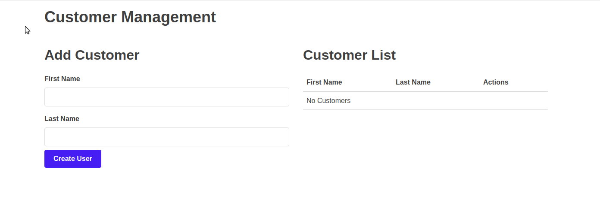

# REST API Demonstration

## Summary

This is a trivial example of a REST wep application. In the classroom environment, each line of code is discussed and greater depth in the labs. This is an introduction to REST concepts and common programming patterns.

## User Interface

There's also TypeScript component to make it easier to visualize the (Create, Read, Update, Delete) operations using the C# API as a backend server.



## Quickstart

Thanks to the wonderful world of `docker`. It's easy to get up and running on any platform. You can easily run the following to get started, assuming you have `docker` and `docker-compose` installed.

```
$ docker-compose up
```

Feel free to make changes and experiment!